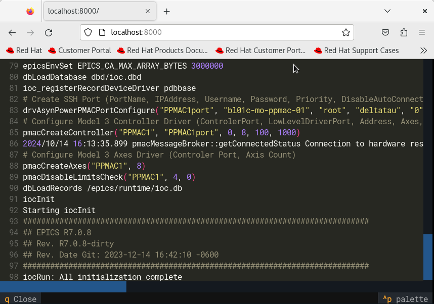

# edge_containers_cli

## About

Edge containers command line interface: a tool for deploying and managing
IOCs in a beamline or accelerator cluster. The tool is a thin wrapper around
familiar command line tools such as git, kubectl, helm and argocd - and can
be used to learn the underlying commands being used.

For detailed documentation on the framework that this supports see:
https://epics-containers.github.io/

Source          | <https://github.com/epics-containers/edge-containers-cli>
:---:           | :---:
PyPI            | `pip install edge-containers-cli`
Releases        | <https://github.com/epics-containers/edge-containers-cli/releases>

To discover the CLI commands, create a python virtual environment,
and perform the following:

    pip install edge-containers-cli
    ec --version

## Monitor

Some commands of the tool are also exposed as a TUI which can additionally be served as
a web application.

To demo the TUI as a web application:

    pip install textual-dev
    textual serve "ec -b DEMO monitor"

Dashboard:

IOC logs:

